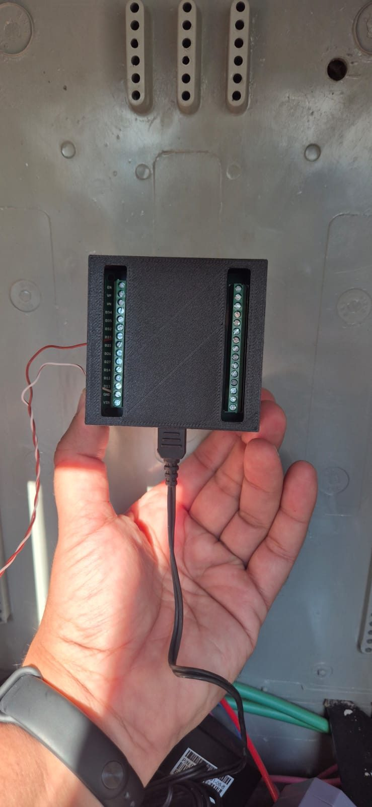
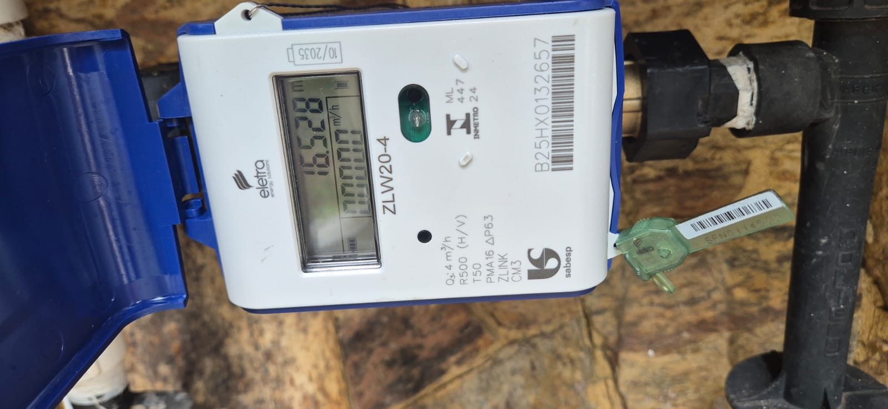
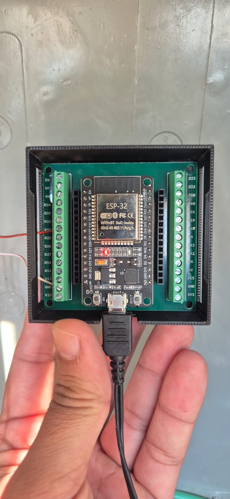

# Automação Leitura Hidrômetro Sabesp Eletra ZLW20-4

> Leia o consumo de água do seu hidrômetro Sabesp em tempo real no Home Assistant, usando um ESP32 + ESPHome — **sem solda, sem violar o lacre e sem mexer em 127 V**.



O hidrômetro **Eletra ZLW20-4** (módulo de medição **Zlink**, ultrassônico) que a Sabesp instala tem uma saída de pulso prevista de fábrica. Este projeto liga essa saída a um ESP32 rodando ESPHome, conta os pulsos por hardware e joga vazão e consumo acumulado direto no Home Assistant.



---

## Por que esse projeto existe

A conta da Sabesp chega uma vez por mês com um número só: quantos metros cúbicos você gastou. Entre uma leitura e outra, seu consumo de água é uma caixa-preta. Você não sabe quanto gasta o chuveiro, se a máquina de lavar está exagerando, nem — o mais importante — **se há um vazamento silencioso** comendo água (e dinheiro) enquanto ninguém olha.

A vontade aqui era simples: enxergar o consumo em tempo real, como já dá pra fazer com energia elétrica. Detectar aquele consumo fantasma de madrugada (quando ninguém deveria estar usando água) é o tipo de coisa que paga o projeto inteiro na primeira vez que pega uma válvula de descarga vazando.

O hidrômetro novo da Sabesp já é eletrônico e tem uma saída de pulso. Em vez de instalar um sensor mecânico extra, dá pra usar o pulso que o próprio medidor oferece. O resultado é um sensor barato, preciso e que conversa nativamente com o Home Assistant.

---

## O que você vai conseguir

- 💧 **Vazão de água em tempo real** (m³/h), atualizada a cada 30 s
- 📈 **Volume acumulado** diário e mensal, persistente entre reboots
- ⚡ **Integração com o Energy dashboard** do Home Assistant (categoria Água), com gráficos automáticos
- 🚨 **Base para detecção de uso anormal** — automação que avisa se há fluxo de madrugada (possível vazamento)
- 💰 **Estimativa de custo** Sabesp a partir do consumo medido
- 🔌 **Tudo de baixa tensão e sem solda** — conexões por borne parafusável e conectores Wago

---

## Compatibilidade

> ⚠️ **Leia antes de comprar.** O fator de conversão (litros por pulso) **muda de medidor para medidor**. Neste projeto ele é **10 L/pulso**, mas você **precisa validar o seu** — veja [docs/CALIBRACAO.md](docs/CALIBRACAO.md).

- ✅ **CONFIRMADO:** Eletra ZLW20-4 (módulo Zlink) fornecido pela Sabesp. Validado em campo com osciloscópio e calibrado contra o display físico.
- 🟡 **PROVAVELMENTE COMPATÍVEL:** outros hidrômetros ultrassônicos/eletrônicos com saída de pulso *open-collector* (coletor aberto). A ligação é a mesma; só o fator L/pulso tende a ser diferente.
- ❌ **INCOMPATÍVEL:** medidores puramente mecânicos sem nenhuma saída elétrica (não há o que ler eletronicamente).

> 💡 **O que é "open-collector"?** É um tipo de saída digital que só sabe fazer uma coisa: "puxar para o terra" (0 V) quando ativa, e "soltar" quando inativa. Quem segura a linha em nível alto (3,3 V) no repouso é o resistor de *pull-up* — neste caso, o pull-up interno do próprio ESP32. Por isso a linha **nunca passa de 3,3 V** e é segura para o GPIO.

---

## Lista de materiais

| Item | Especificação | Onde comprar | Custo aprox. (BRL) |
|------|---------------|--------------|--------------------|
| ESP32 | DEVKITV1, 30 pinos | Mercado Livre / AliExpress | R$ 35–50 |
| **Placa adaptador + case 3D** | Terminal borne para ESP32 30 pinos | [Mercado Livre](https://produto.mercadolivre.com.br/MLB-4163899841-placa-adaptador-terminal-borne-esp32-30-pinos-case-3d-nfe-_JM) | R$ 40–60 |
| Fonte micro-USB | 5 V / 3 A (carregador de celular serve) | qualquer loja | R$ 20–30 |
| Cabo micro-USB | comum | qualquer loja | R$ 10 |
| Cabo de rede UTP | Cat 5e/6, 1 m sobra com folga | qualquer loja | R$ 5–10 |
| Conectores Wago 221 | para emendar os fios (2 unidades) | Mercado Livre / loja elétrica | R$ 10–15 |
| *(opcional)* Multímetro | para diagnóstico | — | — |

**Total: ~R$ 120–175**, sem contar o multímetro.

> 💡 **Por que a placa adaptador com bornes?** Ela elimina totalmente a necessidade de ferro de solda. Cada GPIO do ESP32 vira um borne parafusável: a ligação dos fios vira "afrouxa o parafuso, enfia o fio, aperta o parafuso". Ainda protege a placa dentro de um case fechado. Altamente recomendada para quem não solda.



---

## Resumo da instalação em 5 passos

1. **Identifique os 4 fios** do hidrômetro (preto = GND, azul = sinal de pulso; cinza e marrom não se usam). → [CABEAMENTO.md](docs/CABEAMENTO.md)
2. **Emende** o cabo do hidrômetro a um cabo de rede UTP de 1 m com conectores Wago, mantendo **sinal + GND no mesmo par trançado**. → [CABEAMENTO.md](docs/CABEAMENTO.md)
3. **Parafuse** as duas pontas (azul → GPIO33, preto → GND) nos bornes da placa adaptador e feche o case. → [INSTALACAO.md](docs/INSTALACAO.md)
4. **Grave** o firmware ESPHome no ESP32 e **adote** o dispositivo no Home Assistant. → [INSTALACAO.md](docs/INSTALACAO.md)
5. **Crie o utility_meter** e **adicione ao Energy dashboard**; depois **valide a calibração** contra o display do medidor. → [CALIBRACAO.md](docs/CALIBRACAO.md)

Detalhes completos e passo a passo com fotos em **[docs/INSTALACAO.md](docs/INSTALACAO.md)**.

---

## Quick start ESPHome

Configuração mínima copy-paste (versão completa e comentada em [esphome/medidor-agua.yaml](esphome/medidor-agua.yaml)):

```yaml
sensor:
  - platform: pulse_counter
    name: "Vazão Água"
    pin:
      number: GPIO33
      mode:
        input: true
        pullup: true          # pull-up interno — dispensa resistor externo
    use_pcnt: true            # contagem por hardware (periférico PCNT)
    count_mode:
      rising_edge: DISABLE
      falling_edge: INCREMENT # repouso=HIGH, pulso=LOW
    internal_filter: 13us
    update_interval: 30s
    unit_of_measurement: "m³/h"
    device_class: volume_flow_rate
    state_class: measurement
    filters:
      - multiply: 0.6         # pulsos/min → m³/h (1 pulso = 0,01 m³)
    total:
      name: "Volume Acumulado"
      unit_of_measurement: "m³"
      device_class: water
      state_class: total_increasing
      filters:
        - multiply: 0.01      # pulsos → m³ (1 pulso = 10 L)
```

> ⚠️ Os multiplicadores `0.6` e `0.01` valem para **10 L/pulso**. Se a calibração do seu medidor der diferente, ajuste-os — ver [CALIBRACAO.md](docs/CALIBRACAO.md).

E no Home Assistant, para o acumulado sobreviver a reboots ([snippet completo](home-assistant/utility_meter.yaml)):

```yaml
utility_meter:
  consumo_agua_mensal:
    source: sensor.medidor_agua_volume_acumulado
    cycle: monthly
```

---

## Aviso legal

O hidrômetro pertence à Sabesp e tem um **lacre** que **não deve ser violado**. A boa notícia: **este projeto não exige abrir o lacre.** A saída de pulso é uma funcionalidade prevista pelo fabricante e fica disponível no **conector/fios externos** do medidor — você acessa só esses fios, sem abrir nada lacrado.

Ainda assim:

- Não rompa nenhum lacre nem abra o corpo do medidor.
- Confirme com seu fornecedor/concessionária local que acessar a fiação externa do conector é permitido na sua região.
- Toda a parte elétrica do projeto é de baixíssima tensão (3,3 V / 5 V). **Não há nada de 127/220 V neste projeto** — a alimentação vem de uma fonte micro-USB externa.

Este material é fornecido "como está", para fins educacionais. Você é responsável pela sua própria instalação.

---

## Créditos e contribuições

Projeto pessoal documentado para a comunidade brasileira de casa conectada. Sinta-se à vontade para abrir *issues* com dúvidas, ou *pull requests* com melhorias, fotos de outros medidores e fatores de calibração de modelos diferentes — quanto mais dados de campo, melhor para todo mundo.

Licença [MIT](LICENSE).
