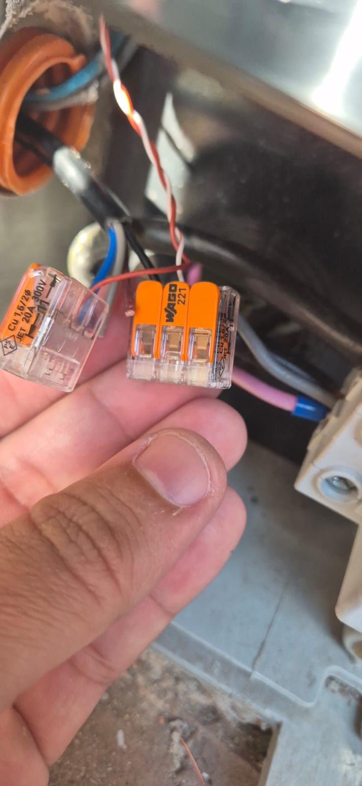
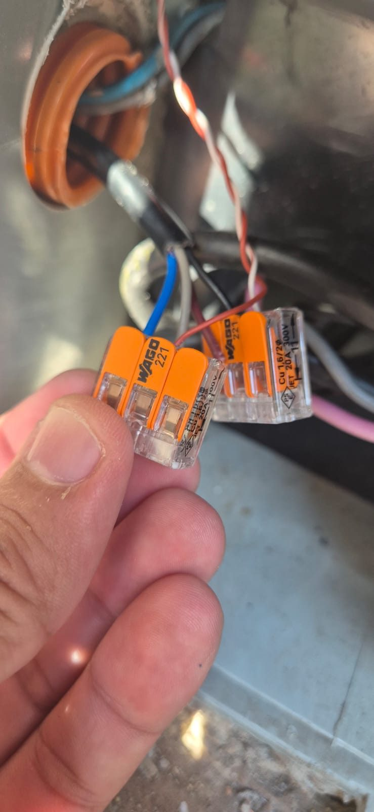

# Cabeamento — do hidrômetro ao ESP32

Este é o documento mais importante do projeto. Acertar o cabeamento é 90% do trabalho; o resto é copiar e colar YAML.

---

## Os 4 fios do hidrômetro

O cabo que sai do conector externo do Eletra ZLW20-4 tem **4 fios**. Só **dois** são usados:

| Fio | Função | Usar? |
|-----|--------|-------|
| **Preto** | GND principal (referência do sinal) | ✅ **Sim** → borne GND |
| **Azul** | Saída de pulso (Hall, *open-collector*, ativa em LOW) | ✅ **Sim** → borne GPIO33 |
| **Cinza** | Segunda saída com pull-up (~3,3 V em repouso) — **não pulsa** em fluxo normal | ❌ Não (isolar) |
| **Marrom** | 0 V em relação ao preto = segundo GND/retorno, não é saída | ❌ Não (isolar) |

> ⚠️ **Armadilha clássica:** o fio **cinza** mostra ~3,3 V no multímetro e *parece* uma segunda saída de sinal. Não é. Ele não pulsa em fluxo normal — provavelmente é alarme de refluxo/vazamento. Não perca tempo tentando fazer ele contar. **Use só o azul.**



---

## Por que cabo de rede (UTP)?

O cabo que já vem no hidrômetro é curto. Para estendê-lo até onde o ESP32 vai morar, o **cabo de rede UTP Cat 5e/6** é uma escolha excelente:

- **Pares trançados** reduzem ruído capacitivo e indutivo — exatamente o que protege um sinal digital fraco de "contar pulsos fantasma".
- É **baratíssimo** e você provavelmente já tem um pedaço sobrando.
- Tem fios de sobra (8 no total) caso queira usar o fio cinza no futuro.

No autor, a distância foi de **1 metro** e o sinal ficou impecável (confirmado no osciloscópio).

---

## Mapeamento dos fios nos pares do cabo de rede

O segredo da imunidade a ruído: **o sinal e o seu retorno (GND) têm que andar SEMPRE no mesmo par trançado.** É o trançado que cancela a interferência.

| Par do cabo UTP | Fios | Liga a |
|-----------------|------|--------|
| **Par 1** — laranja + branco-laranja | Azul (sinal) + Preto (GND) | **Essencial — não separe** |
| **Par 2** — verde + branco-verde | Cinza + Marrom | Reserva (se um dia ativar o alarme do cinza) |
| Par 3 — azul + branco-azul | — | Livre |
| Par 4 — marrom + branco-marrom | — | Livre |

> 💡 As cores dos fios *do cabo de rede* (laranja, verde…) não têm relação com as cores dos fios *do hidrômetro* (azul, preto…). O que importa é: **sinal e GND no mesmo par**. Use o par laranja como combinou aqui e anote para não esquecer.

---

## Caminho do sinal

```
Hidrômetro (4 fios)
   │  azul + preto
   ▼
Emenda com Wago 221
   │  par laranja do cabo UTP (azul→laranja, preto→branco-laranja)
   ▼
Cabo de rede UTP (1 m)
   │
   ▼
Borne parafusável da placa adaptador
   │  azul→GPIO33, preto→GND
   ▼
ESP32
```



---

## Cuidados

- ⚠️ **Não passe PoE (Power over Ethernet) nesse mesmo cabo.** Os 48 V do PoE causam interferência por *crosstalk* e podem estragar a leitura. O cabo de rede aqui é só condutor de sinal, nada de energia nele.
- 💧 **Vede bem a emenda externa**, do lado do hidrômetro. Ela fica exposta ao tempo — use silicone neutro ou uma caixinha IP65. Água na emenda = leitura maluca ou sensor mudo.
- 📏 **Comprimento testado: 1 m.** Para distâncias maiores (até ~10 m) deve funcionar sem problemas, desde que você mantenha o par trançado sinal+GND. Acima disso, teste antes de fixar definitivo (veja o sintoma "tensão em repouso < 3 V" em [DIAGNOSTICO.md](DIAGNOSTICO.md)).

---

➡️ Próximo passo: a montagem física, em **[INSTALACAO.md](INSTALACAO.md)**.
