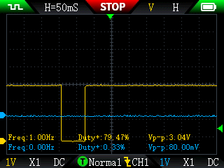

# Diagnóstico e troubleshooting

Como confirmar que o sinal está chegando, com ou sem instrumentos, e o que fazer quando algo não bate.

---

## Características do sinal (referência)

Medido em campo com osciloscópio FNIRSI 2C53T:

| Característica | Valor |
|---------------|-------|
| Tipo | *open-collector / open-drain* |
| Repouso (idle) | ~3,3 V (puxado pelo pull-up interno do ESP32) |
| Ativo (pulso) | cai para ~0 V |
| Amplitude (Vp-p) | **3,04 V** medido (3,3 V nominal) |
| Largura do pulso | 100–150 ms (largo, fácil de capturar) |
| Risco para o GPIO | **Zero** — a linha nunca passa de 3,3 V; a saída só puxa para baixo, nunca injeta os 3,6 V da bateria interna |

Na captura acima (CH1, amarelo): a linha fica em nível alto no repouso e cai para zero durante o pulso — exatamente o comportamento *open-collector ativo em LOW* que o firmware conta na borda de descida.

---

## Verificação sem osciloscópio (só multímetro)

1. Coloque o multímetro em **tensão DC**, ponta preta no GND, ponta vermelha no fio **azul** (sinal), com o pull-up já ativo (ESP32 ligado e fio no GPIO33).
2. **Em repouso (sem fluxo):** deve ler **~3,3 V**. Isso confirma o pull-up e a saída em repouso.
3. **Com água passando:** abra bem uma torneira. A leitura deve **piscar/cair** brevemente para perto de 0 V a cada pulso. Como o pulso dura ~100 ms e o medidor é lento, num multímetro comum você verá oscilações curtas, não um valor estável.
4. Se em repouso já não houver ~3,3 V, o problema é elétrico (ver tabela abaixo).

> 💡 O fio **cinza** também marca ~3,3 V em repouso, mas **não pulsa** — não o confunda com o sinal. O sinal é o **azul**.

---

## Verificação com osciloscópio

Settings sugeridos para capturar o pulso:

- Canal: **CH1** na linha de sinal (azul), GND na referência (preto)
- Vertical: **1 V/div**, acoplamento **DC**
- Horizontal: **50 ms/div** (o pulso de ~100 ms cabe bem na tela)
- Trigger: **borda de descida (falling)**, modo **Single** (Normal)
- Abra a água e dispare: você deve ver a linha cair de ~3,3 V para ~0 V e voltar.

---

## Sintomas → causa → solução

| Sintoma | Causa provável | Solução |
|---------|----------------|---------|
| Sensor zerado, mas há água passando | Fiação trocada, pull-up desligado, `count_mode` errado, ou parafuso do borne frouxo | Confira azul→GPIO33 e preto→GND; confirme `pullup: true` e `falling_edge: INCREMENT`; reaperte os bornes |
| Contagem muito alta / pulsos fantasma | Ruído elétrico acoplado no cabo | Mantenha sinal+GND **no mesmo par trançado**; afaste o cabo de fiação AC; **não** use PoE no mesmo cabo |
| Total zerou após reboot | Falta o `utility_meter` no Home Assistant (o total do pulse_counter vive na RAM) | Configure o `utility_meter` — ver [INSTALACAO.md](INSTALACAO.md#9-configuração-do-utility_meter) |
| Vazão oscila/erra muito em fluxo baixo | `update_interval` curto demais para a cadência dos pulsos | Aumente o `update_interval` (já está em 30 s; pode subir mais) |
| Tensão em repouso < 3 V | Cabo longo demais / pull-up interno fraco para a distância | Encurte o cabo, ou adicione um pull-up externo (ex.: 4,7 kΩ entre o sinal e 3,3 V) |
| Conta o dobro do esperado | Estar contando as duas bordas (subida E descida) | Garanta `rising_edge: DISABLE` e só `falling_edge: INCREMENT` |
| Valores plausíveis, mas não batem com o display | Fator de calibração errado | Calibre contra o display — ver [CALIBRACAO.md](CALIBRACAO.md) |

---

## Notas sobre pulse_counter vs pulse_meter

Existem dois componentes parecidos no ESPHome — não os confunda:

- **`pulse_counter`** (usado aqui): conta com o periférico de hardware **PCNT** do ESP32, filtro de glitch em **microssegundos** (`internal_filter`). Robusto e preciso para medidores eletrônicos. É a escolha recomendada para o hidrômetro ultrassônico.
- **`pulse_meter`**: baseado em interrupção, filtro em **milissegundos**. Útil para reed switch mecânico ruidoso, mas menos indicado aqui.

Para o Eletra ZLW20-4 (saída ultrassônica limpa, pulso largo), **prefira `pulse_counter` com `use_pcnt: true`**.
