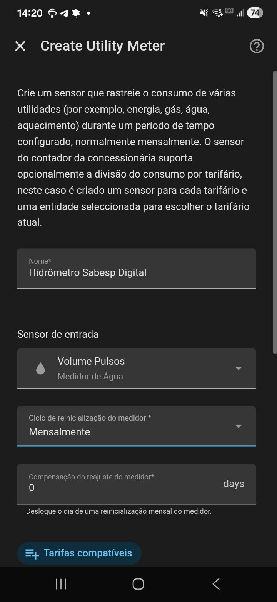

# Instalação — passo a passo

> **Premissa: ZERO solda.** Toda conexão é por borne parafusável (placa adaptador do ESP32) ou por conector Wago (emenda com o cabo do hidrômetro). Você precisa apenas de uma chave de fenda pequena e um alicate de descascar (ou um estilete com cuidado).

---

## 1. Hardware necessário

Veja a [lista de materiais completa no README](../README.md#lista-de-materiais). O essencial:

- ESP32 DEVKITV1 (30 pinos)
- Placa adaptador com bornes + case 3D
- Cabo de rede UTP (~1 m)
- 2 conectores Wago 221
- Fonte micro-USB 5 V / 3 A + cabo micro-USB

---

## 2. Identifique os fios do hidrômetro

| Fio | Função | Uso |
|-----|--------|-----|
| Preto | GND | → GPIO GND |
| Azul | Pulso (sinal) | → GPIO33 |
| Cinza | Alarme (não pulsa) | isolar |
| Marrom | 2º GND/retorno | isolar |

Detalhes e o porquê em [CABEAMENTO.md](CABEAMENTO.md).

---

## 3. Emenda: hidrômetro ↔ cabo de rede

Use **conectores Wago 221** (cada via aceita 1 fio; o de 2 vias junta 2 fios):

1. Descasque ~10 mm da ponta de cada fio.
2. No **primeiro Wago**: junte o **preto** (GND) com o **branco-laranja** do cabo UTP.
3. No **segundo Wago**: junte o **azul** (sinal) com o **laranja** do cabo UTP.
4. **Isole** o cinza e o marrom (fita isolante ou capuz) — não são usados.
5. **Vede a emenda** com silicone neutro ou caixinha IP65, pois ela fica exposta ao tempo.

> 💡 Mantenha azul+preto no **mesmo par trançado** (laranja/branco-laranja) — é o que dá imunidade a ruído.

---

## 4. Conexão: cabo de rede ↔ placa adaptador

Na outra ponta do cabo de rede, descasque o par laranja:

1. Afrouxe o parafuso do borne **GND** da placa adaptador.
2. Enfie a ponta descascada (~5 mm) do fio **branco-laranja** (que vem do preto/GND) e aperte firme.
3. Afrouxe o parafuso do borne **GPIO33** (marcado **D33** na placa).
4. Enfie a ponta do fio **laranja** (que vem do azul/sinal) e aperte firme.
5. Dê um leve puxão em cada fio para conferir que está preso.

---

## 5. Monte o ESP32 e feche o case

1. Encaixe o ESP32 DEVKITV1 na placa adaptador **respeitando a orientação do conector USB** (o USB deve ficar acessível pela abertura do case).
2. Confira que cada pino entrou no soquete correto (sem pino torto ou de fora).
3. Feche o case 3D.

---

## 6. Alimentação

Plugue o cabo micro-USB no ESP32 e na **fonte 5 V / 3 A** (qualquer bom carregador de celular serve), e a fonte numa tomada.

> ✅ Toda a alimentação é externa e de baixa tensão. **Nada de 127/220 V dentro do projeto.**

---

## 7. Flash do firmware ESPHome

1. Tenha o **ESPHome** rodando (add-on no Home Assistant ou `esphome` via Docker/CLI).
2. Copie [`esphome/medidor-agua.yaml`](../esphome/medidor-agua.yaml) para o seu ESPHome.
3. Copie [`esphome/secrets.yaml.example`](../esphome/secrets.yaml.example) para `secrets.yaml` e preencha Wi-Fi, `api_key`, `ota_password` e `ap_password`.
4. Conecte o ESP32 no computador via USB.
5. No ESPHome: **Install → Plug into this computer** (primeiro flash precisa ser por USB).
6. Após o primeiro flash, as próximas atualizações podem ser **OTA** (sem fio).

---

## 8. Adoção no Home Assistant

1. O Home Assistant deve detectar o novo dispositivo ESPHome automaticamente (notificação "Descoberto").
2. Clique em **Configurar** e confirme.
3. Confira as entidades criadas — em especial:
   - `sensor.medidor_agua_vazao_agua` (m³/h)
   - `sensor.medidor_agua_volume_acumulado` (m³)

---

## 9. Configuração do utility_meter

O acumulado do ESP32 vive na RAM e **zera a cada reboot**. O `utility_meter` do Home Assistant resolve isso.

Use o snippet [`home-assistant/utility_meter.yaml`](../home-assistant/utility_meter.yaml) (cole no `configuration.yaml` e reinicie), **ou** crie pela interface: Configurações → Dispositivos e Serviços → Ajudantes → Criar ajudante → **Medidor de consumo**.

---

## 10. Energy dashboard

1. Configurações → **Painéis → Energia**.
2. Em **Consumo de água**, adicione o sensor mensal (ex.: `sensor.consumo_de_agua_mensal`).
3. Os gráficos de água aparecem após algumas horas de dados.

---

## 11. Validação inicial

1. Anote a leitura atual do **display do hidrômetro** (precisão de 1 L).
2. Anote o valor de `Volume Acumulado` no Home Assistant.
3. Use água deliberadamente — pelo menos **20 a 50 L** (encher um balde algumas vezes, dar descarga etc.).
4. Compare: o incremento no Home Assistant deve bater com o incremento no display.
5. Se não bater, calibre — veja **[CALIBRACAO.md](CALIBRACAO.md)**.

> 💡 **História de campo:** numa versão anterior deste projeto, o sensor parecia perder ~80% da água. Não era ruído nem fiação: era o **fator de calibração errado** (assumiram 2 L/pulso por causa do "R500" na etiqueta, quando o real é 10 L/pulso). A lição: **nunca confie na etiqueta — calibre contra o display.** Veja o porquê em [CALIBRACAO.md](CALIBRACAO.md).

---

➡️ Problemas? Vá para **[DIAGNOSTICO.md](DIAGNOSTICO.md)**.
